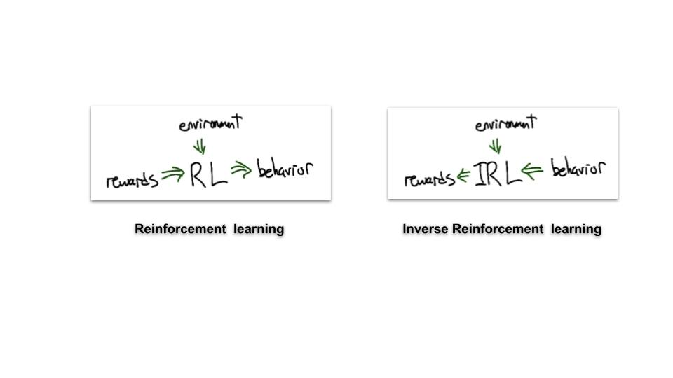
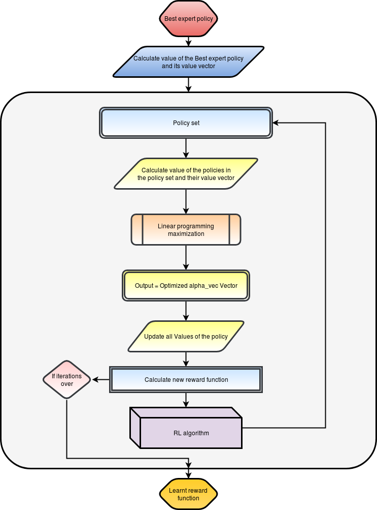

# Inverse Reinforcement Learning
Implementation of [Linear Inverse Reinforcement Learning Algorithm](https://ai.stanford.edu/~ang/papers/icml00-irl.pdf) (IRL) on Mountain Car Environment. Mainly for educational purpose.

### Overview 
- The RL domain was developed based on the sole presupposition that `Reward functions are the most succinct, robust and transferable defination of a task.` But, in cases like **robotic manipulations** and **self driving cars**, defining a reward function becomes almost impossible.
- 
- The first LIRL algorithm was published in a paper [Algorithms for IRL](https://ai.stanford.edu/~ang/papers/icml00-irl.pdf) (Ng & Russel 2000) in which they proposed an iterative algorithm to extract the reward function given optimal/expert behavior policy for obtaining the goal in that particular environment.
- This code is an attempt to test IRL algorithm on Mountain Car environment given ```m``` expert trajectories. 
- Following Section 5 of [IRL](https://ai.stanford.edu/~ang/papers/icml00-irl.pdf) paper(Ng & Russel).


### LIRL Algorithm Flowchart
<p align="center">
  
</p>

### Implementation 
- #### Expert Policy Generation
    - Used Q-learning algorithm with linear approximators to train the agent for generating expert policy.(This is done as it becomes difficult for humans to generate expert policies in Mountain Car)
- #### IRL implementation
    - Given the best expert policy, IRL algorithm learns the best reward function for the agent and returns it to the agent.
- #### How good is the learnt reward function?
    - Timesteps required to converge to the optimal solution.
        - Using the learnt reward function, it was observed that the timesteps to learn were significantly less than the default reward function inbuilt in the Mountain car env.
        - 
    - Average reward after completion of task.
        - There is a code block for generating results in the notebook which basically averages reward over 100 trajectories with random start position using the learnt policy based on:
            - 1) Learnt reward function 
            - 2) Default reward function.
        
### How to use
1. ``` git clone ``` the repository.
2. Execute the jupyter notebook code blocks in order.
